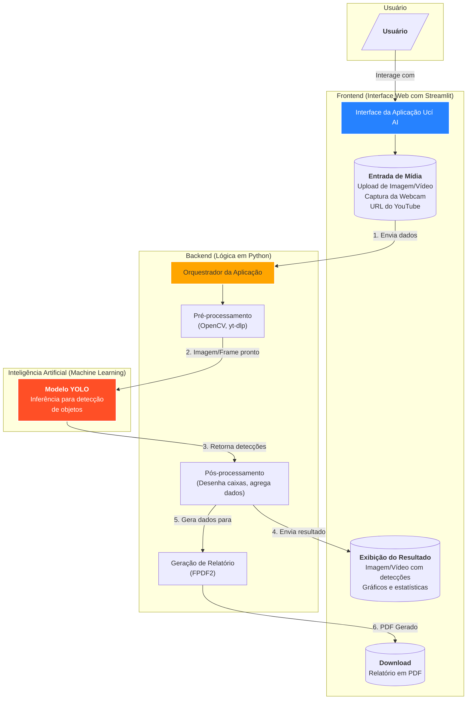

# Ucí AI - Análise de Materiais Recicláveis com IA

Ucí AI (do Nhengatu, onde 'Ucí' significa 'Limpar') é uma aplicação web desenvolvida com Streamlit que utiliza um modelo de detecção de objetos (YOLO) para identificar materiais recicláveis (garrafas, latas, etc.) em imagens e vídeos.

## 📜 Descrição

A aplicação oferece uma interface interativa para que os usuários possam realizar análises de materiais a partir de diversas fontes. O sistema processa o conteúdo, identifica os materiais recicláveis e apresenta um relatório consolidado com estatísticas e gráficos.

## 🔗 Links Úteis
- **Repositório GitHub:** [https://github.com/jpscard/Uc-AI](https://github.com/jpscard/Uc-AI)
- **Aplicação Streamlit:** [https://uciaiv1.streamlit.app/](https://uciaiv1.streamlit.app/)

## 🗺️ Fluxograma da Arquitetura



## ✨ Funcionalidades

- **Interface Intuitiva**: Navegação simplificada com abas para cada funcionalidade.
- **Análise Multi-fonte**: Analise materiais a partir de:
    - **Imagens**: Faça upload de arquivos de imagem (JPG, PNG, etc.).
    - **Vídeos**: Envie arquivos de vídeo para análise.
    - **Webcam**: Realize detecção em tempo real usando sua webcam.
    - **YouTube**: Cole a URL de um vídeo do YouTube para análise direta.
- **Modelo de Detecção YOLO**: Utiliza um modelo `ultralytics` treinado para identificar e classificar objetos de interesse.
- **Relatórios Detalhados**: Ao final da análise, um relatório consolidado é gerado, incluindo:
    - Tabela com dados de detecção.
    - Gráficos de análise.
    - Opção para baixar o relatório completo em formato **PDF**.
- **Visualização de Desempenho**: Uma seção dedicada para visualizar as métricas de desempenho do modelo de IA, como mAP, Precisão e Recall.

## 🛠️ Tecnologias Utilizadas

- **Backend & Frontend**: Python, Streamlit
- **Inteligência Artificial**: PyTorch, Ultralytics (YOLO)
- **Processamento de Mídia**: OpenCV, yt-dlp
- **Relatórios**: FPDF2
- **Visualização de Dados**: Pandas, Matplotlib

## 👨‍💻 Equipe

O projeto foi desenvolvido pelo **Grupo 5**, composto pelos seguintes membros:

- Felipe Rafael dos Santos Barbosa
- João Paulo da Silva Cardoso
- Victor Amazonas Viegas Ferreira

## 🚀 Como Executar o Projeto

1.  **Clone o repositório.**
2.  **Crie e ative um ambiente virtual:**
    ```bash
    python -m venv .venv
    source .venv/bin/activate  # Linux/macOS
    .venv\Scripts\activate  # Windows
    ```
3.  **Instale as dependências:**
    ```bash
    pip install -r requirements.txt
    ```
4.  **Execute a aplicação Streamlit:**
    ```bash
    streamlit run app.py
    ```
